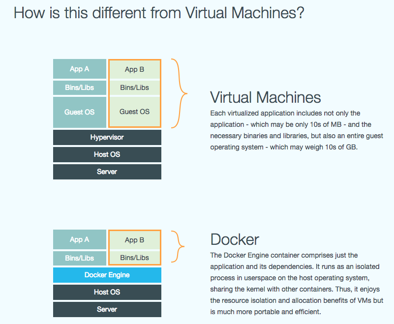
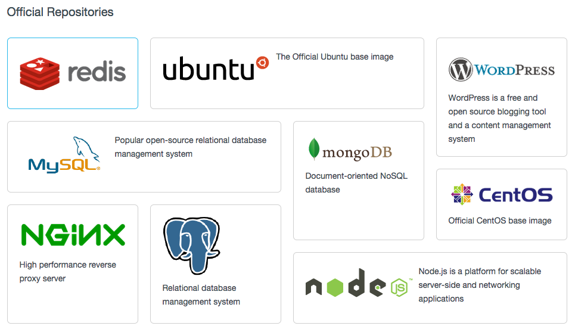
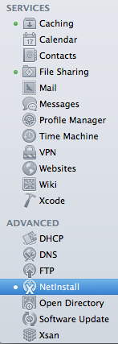

# Introducing Docker to Mac Management

### Nick McSpadden Client Systems Manager Schools of the Sacred Heart

---

# What the heck is Docker?

### [https://www.docker.com/whatisdocker/]()

---

# Simple explanation:
##A wrapper around a tiny sandboxed Linux environment.

##Docker containers are designed to run a single service or application.

---

# Thinner than running a new VM for a service

---

# Examples:

* A database - Postgres, MySQL
* Webserver
* Puppet server
* Wordpress blog
* Node.js

  
  
[https://www.docker.com/resources/usecases/]()

---

# But this is all Linux based! How does this involve Macs? I have OS X Server!

---

# Look at Server.app.

Not many services that are truly unique to OS X:

* Caching Service (arguable vs. squid)
* Messages (no one uses this)
* Time Machine Server (no one uses this)
* Xcode (don't, it'll hurt)
* OpenDirectory (not common in enterprise)
* Xsan (wait, this still exists?)

---

* CalDAV
* NFS, SMB, Netatalk (lol)
* Mail (duh)
* Mobile Device Management
* Enterprise backup (Code42?)
* VPN via firewall appliances
* Apache / nginx
* Git
* dhcpd
* bind
* BSDPy

---

# You can run lots of neat Mac management tools without ever needing OS X Server, or OS X.

## And if you can do it in Linux...

---

# ...you can do it in Docker!

---

# Time for demo.