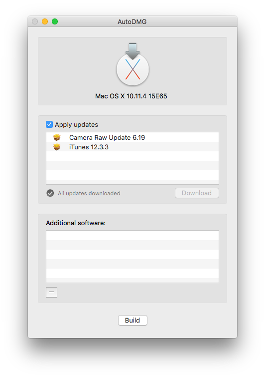
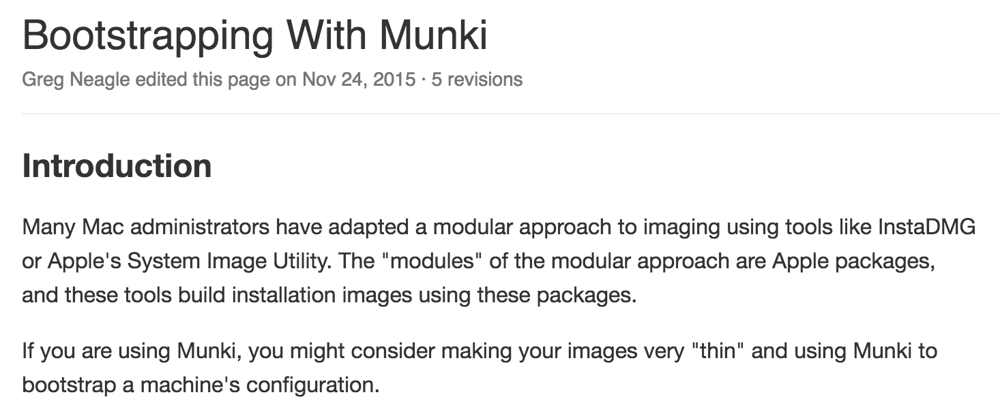
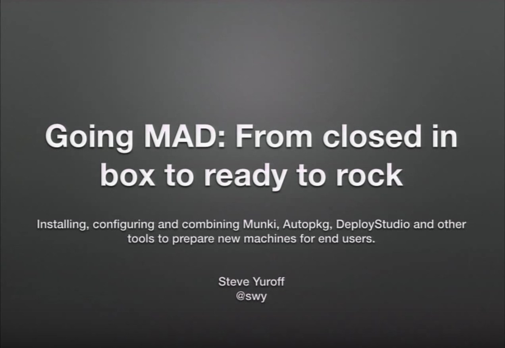
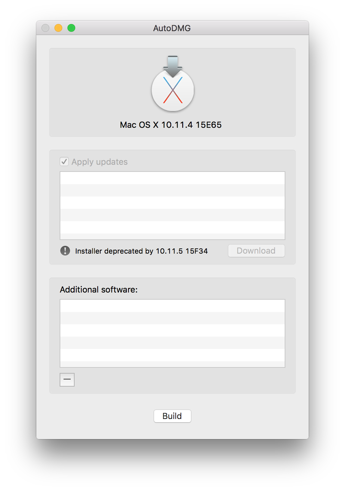
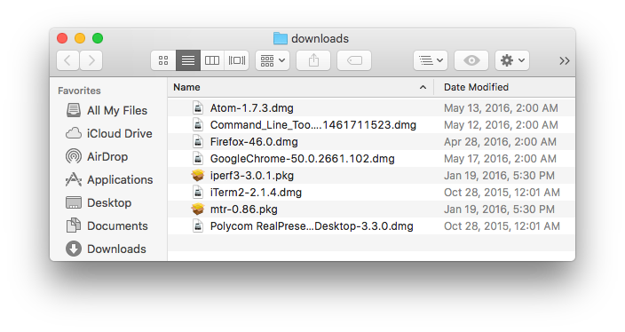
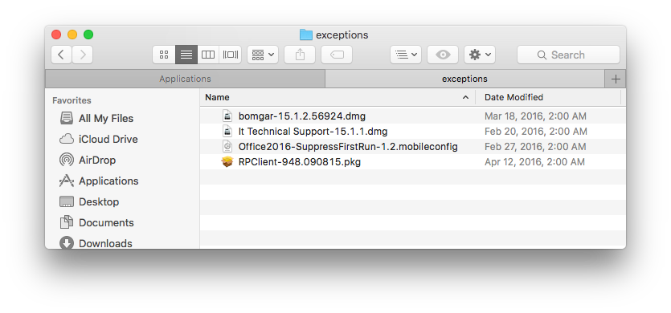
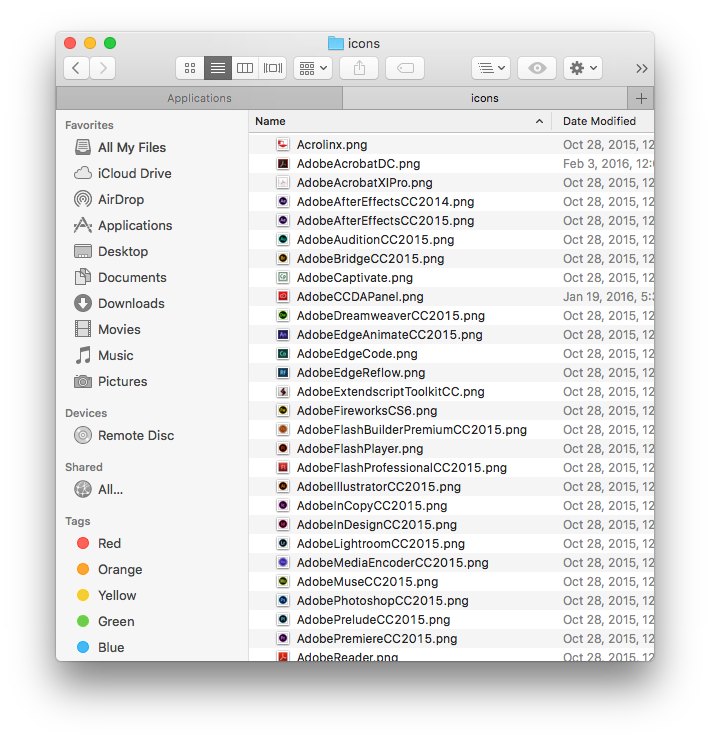
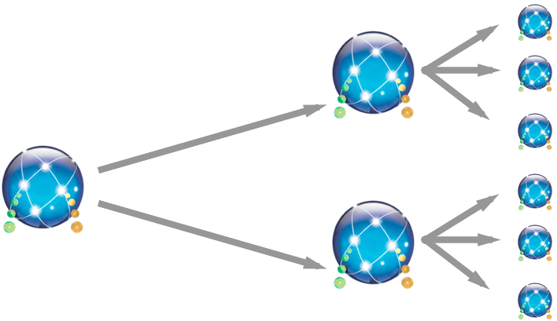
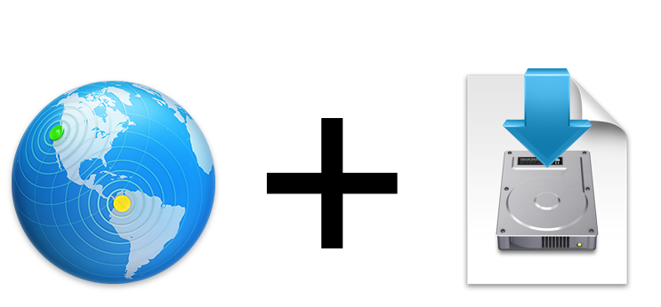

build-lists: true
footer: MacBrained, May 2016 
slidenumbers: false

# Automating Imaging Creation at Facebook 
### Wizardry Edition

#### Nick McSpadden

---

# Imaging is dead. 

^ "Thin" deployments are the new hotness

---

# DEP + MDM + thin provisioning is the new hotness.

^ DEP / VPP / MDM are the "Apple" way of managing and deploying Macs.

---

# A machine bought from Apple turned on for the first time proceeds to set itself up.  Handy!


---

# On first boot:

🕐
- Let's go ahead and install MS Office...

--- 

# On first boot:

🕐🕑
- Let's go ahead and install MS Office...

--- 
# On first boot:

🕐🕑🕒
- Let's go ahead and install MS Office...

--- 
# On first boot:

🕐🕑🕒🕔
- Let's go ahead and install MS Office... ✅
- Let's install Firefox

---
# On first boot:

🕐🕑🕒🕔🕕
- Let's go ahead and install MS Office... ✅
- Let's install Firefox ✅
- Let's install Chrome 

---
# On first boot:

🕐🕑🕒🕔🕕🕖
- Let's go ahead and install MS Office... ✅
- Let's install Firefox ✅
- Let's install Chrome ✅
- Let's install Photoshop

---
# On first boot:

🕐🕑🕒🕔🕕🕖🕗
- Let's go ahead and install MS Office... ✅
- Let's install Firefox ✅
- Let's install Chrome ✅
- Let's install Photoshop

---
# On first boot:

🕐🕑🕒🕔🕕🕖🕗🕘
- Let's go ahead and install MS Office... ✅
- Let's install Firefox ✅
- Let's install Chrome ✅
- Let's install Photoshop

---
# On first boot:

🕐🕑🕒🕔🕕🕖🕗🕘🕙
- Let's go ahead and install MS Office... ✅
- Let's install Firefox ✅
- Let's install Chrome ✅
- Let's install Photoshop ✅

---
# On first boot:

🕐🕑🕒🕔🕕🕖🕗🕘🕙🕚
- Let's go ahead and install MS Office... ✅
- Let's install Firefox ✅
- Let's install Chrome ✅
- Let's install Photoshop ✅
- Apply configurations

---
# On first boot:

🕐🕑🕒🕔🕕🕖🕗🕘🕙🕚🕛
- Let's go ahead and install MS Office... ✅
- Let's install Firefox ✅
- Let's install Chrome ✅
- Let's install Photoshop ✅
- Apply configurations ✅
- Run Apple updates

---
# On first boot:

🕐🕑🕒🕔🕕🕖🕗🕘🕙🕚🕛🕐
- Let's go ahead and install MS Office... ✅
- Let's install Firefox ✅
- Let's install Chrome ✅
- Let's install Photoshop ✅
- Apply configurations ✅
- Run Apple updates

---
# On first boot:

🕐🕑🕒🕔🕕🕖🕗🕘🕙🕚🕛🕐🕑
- Let's go ahead and install MS Office... ✅
- Let's install Firefox ✅
- Let's install Chrome ✅
- Let's install Photoshop ✅
- Apply configurations ✅
- Run Apple updates

---
# On first boot:

🕐🕑🕒🕔🕕🕖🕗🕘🕙🕚🕛🕐🕑🕒
- Let's go ahead and install MS Office... ✅
- Let's install Firefox ✅
- Let's install Chrome ✅
- Let's install Photoshop ✅
- Apply configurations ✅
- Run Apple updates

---
# On first boot:

🕐🕑🕒🕔🕕🕖🕗🕘🕙🕚🕛🕐🕑🕒🕓
- Let's go ahead and install MS Office... ✅
- Let's install Firefox ✅
- Let's install Chrome ✅
- Let's install Photoshop ✅
- Apply configurations ✅
- Run Apple updates ✅
  - Now *reboot*!

---

# Dynamic provisioning is great and flexible.

# It's the best option for many, if not most.

---

# But it's not very *fast*.

^ At Facebook, *speed* is of the essence, due to sheer volume of numbers. During intern season, we need to go through hundreds of machines in a manner of weeks. Thin deployments just aren't fast enough.

---

# The context to this solution is:
# *speed above all else*

--- 

# Imaging is fast!


---

# Imaging is fast: Pros

AutoDMG + Apple updates gives us a fast deploy of a fresh system.



---

# Imaging is fast: Pros

AutoDMG + first-boot config + first-boot software installation (i.e. AutoDMG + Munki) is a popular choice.



---



<br>
<br>
"Going MAD" - Steve Yuroff,
PSU Mac 2014
[https://youtu.be/UG84nedo4ag]()
<br>
AutoDMG -> 
Munki, AutoPkg, DeployStudio 

is the staple of efficient thin-imaging.

---

# Imaging is fast: Pros

In such a scenario, the image rarely needs rebuilding or change.



---

# Imaging is fast: Cons

* We're only saving a little bit of time by deploying *just* the image via block-restore.
* Munki still has to download and install all the software on first boot (non-interactively, at least).
* We've shifted the problem only a little bit and haven't really saved much time.
* Transferring big images across the world is expensive.

---

# We want speed *and* flexibility.

---

# Ideal scenario:
# As much of the work as possible is already done, in the image.

---

# Ideal scenario #2:
# We don't want to transfer big honkin' images to multiple sites across the world.

---

# What We Need To Do:
* Build base OS + Apple updates.
* Preinstall as much software as possible (from Munki).
* Preload all of our caches / config data.
* Preload all of our on-boot actions to trigger.
* Construct all of this dynamically without manual interaction.
* Ideally, work with any disk restoration tool.

---

# That doesn't sound so hard, right?

---


^ bee721, [https://flic.kr/p/9P8SNb](), [Creative Commons 2.0](https://creativecommons.org/licenses/by-nc-sa/2.0/legalcode)

---

# AutoDMG Cache Builder: 
## [`https://github.com/facebook/IT-CPE/tree/master/autodmg_cache_builder`](https://github.com/facebook/IT-CPE/tree/master/autodmg_cache_builder)

---

# How it works...

* AutoDMG - the base image + Apple updates
<br>
<br>
* Munki - find out what software should be installed  
<br>
<br>
* Org-specific packages - add extra packages we build

---

# Creating The Image: AutoDMG

* AutoDMG gives us the base OS, and Apple updates.
<br>

* It also supports templates that allow arbitrary packages to be added.
<br>
* It can work entirely via CLI, no GUI interaction required.

---

# Wizard version:

Start with a base OS + Apple updates:


---

# Wizard version:

Query Munki for list of software that should be installed.
Download that software into a local cache:



---

# Wizard version:

If it's a "simple" package, add it to AutoDMG template.
If it's a "complex" item, add it to Munki "exceptions" folder:



---

# Wizard version:

Add any arbitrary packages I've specified to the AutoDMG template:

```
<dict>
  <key>AdditionalPackages</key>
  <array>
    ...
    <string>additions/Microsoft_Office_2016_15.22.0.pkg</string>
    ...
```

---

# Wizard version:

Download Munki icon cache, add to AutoDMG template:



---

# Wizard version:

Download Chef cookbook cache, add to AutoDMG template.
Extras: 
  * TCC db, FileVault keychains, Diagnostics suppression, iCloud/Setup Assistant suppression, etc.

```
    <string>/Library/AutoDMG/munki_icons.pkg</string>
    <string>/Library/AutoDMG/munki_cache.pkg</string>
    <string>/Library/AutoDMG/chef_cache.pkg</string>
    <string>/Library/AutoDMG/cpe_tcc.pkg</string>
    <string>/Library/AutoDMG/cpe_fv.pkg</string>
    <string>/Library/AutoDMG/cpe_wallpapers.pkg</string>
    <string>/Library/AutoDMG/suppress_diagnostics.pkg</string>
    <string>/Library/AutoDMG/suppress_registration.pkg</string>
```

---

# Wizard version:

Once all of our packages are built and added to the template, we can construct the image itself.

`autodmg_cache_build.py
  --extras except_adds.json
  --dsrepo /Users/Shared/Deploystudio
  --source /Applications/Install OS X El Capitan.app`

---

# That's the *main* part - just building the image. How we do make this work for 60+ imaging servers worldwide?

---

# Previously, on MacBrained...

---

# Our old strategy:

* Local DeployStudio Server as a master server

* Each region contained a replica - "Regional Master"

* Each office contained a replica pointing to the nearest Regional Master

* 

---

## This was cool and all, but it took a significant amount of time to iterate changes across the globe, since DS sync only occurred nightly.

---

### If I made a change too late in the day, the change might not propagate across all the imaging servers that day, because of time zones.


^ Maria Zavarzina, [https://flic.kr/p/nsDAVq](), [Creative Commons 2.0](https://creativecommons.org/licenses/by-nc-sa/2.0/legalcode)

---

# Wizard version, Part Deux:

Rather than transfer this 10+ GB image across the globe on a nightly basis, each site can build this image at each endpoint.



---

# Wizard version, Part Deux:
Bandwidth usage to each endpoint:

* OS Installer from App Store (~6 GB only a few times a year)
* Standard Munki updates (probably not more than ~300 mb every few days, on average)
* New Apple updates (~150 mb a week, maybe?)

---

# Wizard version, Part Deux:

Requirements:

* Server.app for NetBoot (and Caching, why not)
* OS Installer
* AutoDMG
* Munki

---

# Automation:

Server.app can be automated with Bash using `expect`:

[https://derflounder.wordpress.com/2015/10/29/automating-the-setup-of-os-x-server-on-el-capitan-and-yosemite/]()


---

# Automation:

Similarly with Python using [`pexpect`](https://pexpect.readthedocs.io/en/stable/):

```
import sys
import pexpect
server_contents = '/Applications/Server.app/Contents'
servercmd = "%s/ServerRoot/usr/sbin/server" % server_contents
server_eula = pexpect.spawn('%s setup' % servercmd, timeout=300)
server_eula.logfile = sys.stdout
server_eula.sendline(' ')
server_eula.expect("(y/N)")
server_eula.sendline('y')
server_eula.expect("User name:")
server_eula.sendline(username)
server_eula.expect("Password:")
server_eula.sendline(password)
try:
  server_eula.expect(pexpect.TIMEOUT, timeout=None)
except:
  pass
sys.exit(0)
```

---

# Automation:
<br>
<br>
With DeployStudio, you can use [Per Oloffson's](http://magervalp.github.io/) [AutoDSNBI](https://github.com/MagerValp/AutoDSNBI) script to automate the building of the DS NBI.

---

# Automation:
LaunchDaemon to run the image build script:

```
  <key>ProgramArguments</key>
  <array>
    <string>/path/to/autodmg_cache_build.py</string>
    <string>--extras</string>
    <string>/Library/AutoDMG/except_adds.json</string>
    <string>--dsrepo</string>
    <string>/Users/Shared/DeployStudio</string>
    <string>--source</string>
    <string>/Applications/Install OS X El Capitan.app</string>
  </array>
  <key>StartCalendarInterval</key>
  <array>
    <dict>
      <key>Hour</key>
      <integer>2</integer>
      <key>Minute</key>
      <integer>0</integer>
    </dict>
  </array>
```

---

# And finally, the end result is...

---

# A fully updated image:
## with most of the software preloaded,
## with minimal post-restore activity,
## that can be deployed using any disk restore tool,
## built individually on each server.

---

### This involved a lot of wizardry and magic "hand-waving."  

### There's a whole lot more about how we completely automate imaging server setup using Chef, and how none of this requires any interaction whatsoever.

### Further details on full implementation can be found on my blog, and on the IT-CPE Github page.

---

# Sources

* Scared cat: bee721, [https://flic.kr/p/9P8SNb](),
[Creative Commons 2.0](https://creativecommons.org/licenses/by-nc-sa/2.0/legalcode)

* Angry cat: Maria Zavarzina, [https://flic.kr/p/nsDAVq](),
[Creative Commons 2.0](https://creativecommons.org/licenses/by-nc-sa/2.0/legalcode)

