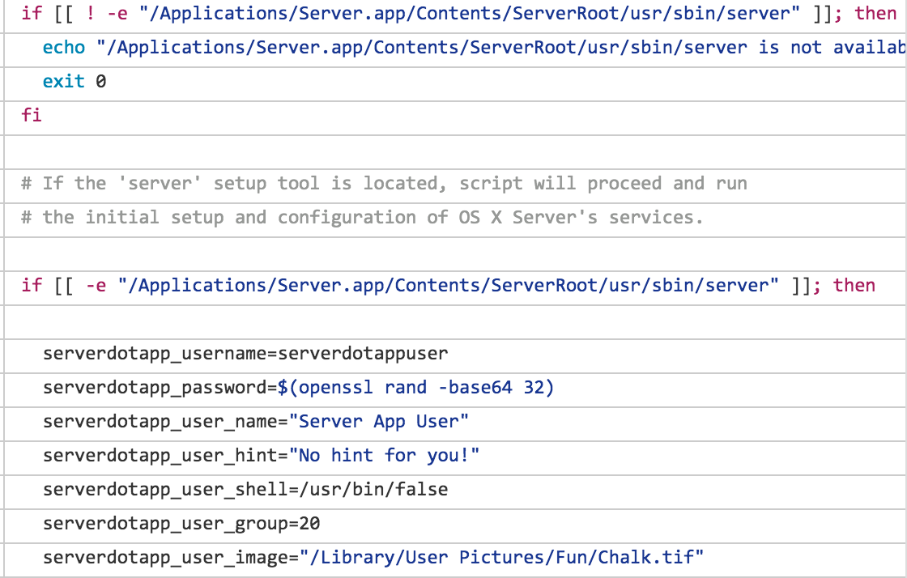

build-lists: true
footer: MacBrained, May 2016 
slidenumbers: false

# Automating Imaging Creation at Facebook 
## Heavy Edition

#### Nick McSpadden, Milestone @ Facebook

---

# How We Do It:

AutoDMG - the base image  
<br>
<br>
Munki - software deployment  
<br>
<br>
Chef - config management  

---
# Creating The Image: AutoDMG

AutoDMG gives us the base OS, and Apple updates.
<br>

It also supports templates that allow arbitrary packages to be added.
<br>
It can work entirely via CLI, no GUI interaction required.

---

# Software Deployment: Munki

We specify what software goes on the machine, Munki downloads and installs it.
<br>

To simplify matters, all machines get the same basic set of software regardless of eventual destination.
<br>

The Munki manifest has a list of all items that will be installed, on a remote server.

---

# Configuration Management: Chef

Chef applies all of our management, policies and configurations. 
<br>

Chef needs to run first to lay down the policies (including binding to directory services so a user can log in).
<br>

Until Chef completes its first two runs, the machine is incomplete.

---

# The Process

---

## We can query Munki for the list of software it thinks should be installed.

## To do that, we can use Munki code directly in Python.

---

# Adding `munkilib` to your Python code:

```
import sys
with open('/private/etc/paths.d/munki', 'rb') as f:
  munkipath = f.read().strip()
sys.path.append(os.path.join(munkipath, 'munkilib'))
try:
  from munkicommon import pref, getsha256hash
  import updatecheck
  from fetch import (getURLitemBasename, getResourceIfChangedAtomically,
                     MunkiDownloadError, writeCachedChecksum,
                     getxattr, XATTR_SHA)
  import keychain
except ImportError as err:
  print "Something went wrong! %s" % err
```

---

## We can use Munki code to download these items from the repo:
```
# These are necessary to populate the globals used in updatecheck
keychain_obj = keychain.MunkiKeychain()
manifestpath = updatecheck.getPrimaryManifest(manifest)
updatecheck.getPrimaryManifestCatalogs(.manifest)
updatecheck.getCatalogs([catalog])
# Populate the lists
installinfo = {}
installinfo['processed_installs'] = []
installinfo['processed_uninstalls'] = []
installinfo['managed_updates'] = []
installinfo['optional_installs'] = []
installinfo['managed_installs'] = []
installinfo['removals'] = []
updatecheck.processManifestForKey(manifestpath, 'managed_installs',
                                  installinfo)
# installinfo['managed_installs'] now contains a list of all managed_installs
```

---
With the `installinfo` dict populated, we can get a list of `managed_intalls` that belong to a provided catalog:
<br>

```
  install_list = []
  for item in installinfo['managed_installs']:
    detail = updatecheck.getItemDetail(item['name'], [args.catalog])
    if detail:
      install_list.append(detail)
```

---

## For simple packages, we can download them, and add these to the AutoDMG template.

---

## For "complex" or non-standard items (like profiles), we can pre-download them and place them in the Munki cache.

Bootstrap time can be reduced significantly by pre-downloading Munki items into `/Library/Managed Installs/Cache/`.

---

# Exceptions & Additions

We use a JSON file containing a list of exceptions and additions to be cached/added:

```
{
  "additions_list": [  
    # These get downloaded & added directly to the AutoDMG template
    "https://munki/munki_repo/pkgs/apps/microsoft/office2016/Microsoft_Office_2016_15.22.0_160506_Installer-15.22.0.pkg",
    "https://munki/munki_repo/pkgs/profiles/Office2016-SuppressFirstRun-1.2.mobileconfig"
  ],
  "exceptions_list": [ 
    # These are Munki items that should be installed by Munki bootstrapping
    "BomgarClient",
    "Computrace",
    "MicrosoftOffice2016_Serializer"
  ]
}
```

---

# Additions
These packages get added to the AutoDMG template - either a local file path, or available by URL.

```
{
  "additions_list": [  
    # These get downloaded & added directly to the AutoDMG template
    "https://munki/munki_repo/pkgs/apps/microsoft/office2016/Microsoft_Office_2016_15.22.0_160506_Installer-15.22.0.pkg",
    "https://munki/munki_repo/pkgs/profiles/Office2016-SuppressFirstRun-1.2.mobileconfig"
  ],
```

---

# Exceptions
These packages cannot be safely installed onto a disk image, usually due to package scripts that are not well-crafted. 
<br>

Instead we place them directly into the Munki cache folder, so that Munki doesn't need to spend time downloading during bootstrapping.

```
  "exceptions_list": [ 
    # These are Munki items that should be installed by Munki bootstrapping
    "BomgarClient",
    "MicrosoftOffice2016_Serializer"
  ]
}
```

---

# Some other things we want to consider:

Munki caches the icons of all the items in Managed Software Center.

Chef caches all of the cookbooks it runs locally.

We want to preload special configs and our Mac management codebase.

We want to avoid downloads or dependencies on external sources as much as possible.

---

## The script needs to be able to build any custom packages we need, on-demand and dynamically.

## The `autodmg_org` module contains a function `run_unique_code()` that can be support all of our custom package building.

---

# The Workflow:

---

# 1

## Query list of Munki items to be installed.


---

# 2

## Download all Munki items to be installed into a local download folder.

---

# 3

## If it's a normal package, add it to the AutoDMG template.

## If it's an "unsafe" item or Exception, move it to a staging Munki cache folder.

---

# 4

## Download & package up all of the Munki icons.

---

# 5

## Package up the "unsafe"/Exceptions Munki cache.

---

# 6

## Add in all the additional packages we specified in the Extras file.

---

# 7

## Org-specific code: Package up all of the Chef cookbook cache.

---

# 8

## Org-specific code: Preload in our first-boot behavior (Chef bootstrapping code).

---

# 9

## Download AutoDMG's available software updates, specified in [`UpdateProfiles.plist` template](https://github.com/MagerValp/AutoDMGUpdateProfiles/blob/master/UpdateProfiles.plist).

```
  <key>Profiles</key>
  <dict>
    <key>10.10.5-14F27</key>
    <array>
      <string>RemoteDesktopClient</string>
      <string>iTunes</string>
      <string>SafariYo</string>
      <string>SecurityYo</string>
    </array>
    <key>10.11.5-15F34</key>
    <array>
      <string>iTunes</string>
    </array>
```

---

# 10

## Build the "bare" image (Base OS + Updates, nothing else) if it doesn't already exist. We use this for Donations or similar needs.

---

# 11

## Build the image from our AutoDMG template.

---

# 12

## Move the completed images to the DeployStudio repo.

---

# Building the image alone isn't enough. 

# We want to automate the entire imaging server setup process, top to bottom.

---

# Imaging servers need:

* Server.app for NetBoot (and Caching)
* AutoDMG
* Munki
* DeployStudio
* LaunchD to build the image
* LaunchD to build the NBI

---
# Server.app

Server.app can be automated with Bash using `expect`:

[https://derflounder.wordpress.com/2015/10/29/automating-the-setup-of-os-x-server-on-el-capitan-and-yosemite/]()



---
# Server.app
Similarly with Python using [`pexpect`](https://pexpect.readthedocs.io/en/stable/):

```
import sys
import pexpect
server_contents = '/Applications/Server.app/Contents'
servercmd = "%s/ServerRoot/usr/sbin/server" % server_contents
server_eula = pexpect.spawn('%s setup' % servercmd, timeout=300)
server_eula.logfile = sys.stdout
server_eula.sendline(' ')
server_eula.expect("(y/N)")
server_eula.sendline('y')
server_eula.expect("User name:")
server_eula.sendline(username)
server_eula.expect("Password:")
server_eula.sendline(password)
try:
  server_eula.expect(pexpect.TIMEOUT, timeout=None)
except:
  pass
sys.exit(0)
```

---

# AutoDMG LaunchDaemon:
Run the image build script nightly at 2 AM:

```
  <key>ProgramArguments</key>
  <array>
    <string>/path/to/autodmg_cache_build.py</string>
    <string>--extras</string>
    <string>/Library/AutoDMG/except_adds.json</string>
    <string>--dsrepo</string>
    <string>/Users/Shared/DeployStudio</string>
    <string>--source</string>
    <string>/Applications/Install OS X El Capitan.app</string>
  </array>
  <key>StartCalendarInterval</key>
  <array>
    <dict>
      <key>Hour</key>
      <integer>2</integer>
      <key>Minute</key>
      <integer>0</integer>
    </dict>
  </array>
```

---
# NBI Creation:
<br>
<br>
With DeployStudio, you can use [Per Oloffson's](http://magervalp.github.io/) [AutoDSNBI](https://github.com/MagerValp/AutoDSNBI) script to automate the building of the DS NBI.

---

# AutoDSNBI LaunchDaemon:
Run the NBI build script nightly at 1 AM:

```
launchd goes here
```

---

# 