# User Experiences & Expectations  

### Managing The User Experience As An Admin


#### Nick McSpadden
#### Schools of the Sacred Heart
      
---
### What do users want to do with their devices?


---

### What users think they're doing:


---

### What we think users are doing:

( video of users deleting everything )

---

### Users want things to be easy and straightforward.


---
### How To Annoy Users:
* Present mysterious or ambiguous messages  

* Demand or prompt for information they don't have


---
### How To Annoy Users:
* Make users guess an answer they don't understand

* Deny access because of policy, without explanation


---

###The more times a user has to ask for help, they more they'll resent asking for help.

### And it's always your fault, and your department's fault.

---
## Give your users more control over their own destiny - or even just the illusion of more control.

---
*Give users the ability to do stuff on their own*

* Let users pick and choose what productivity software they want

  

---
*Give users the ability to do stuff on their own*

* Let them pick and choose available printers

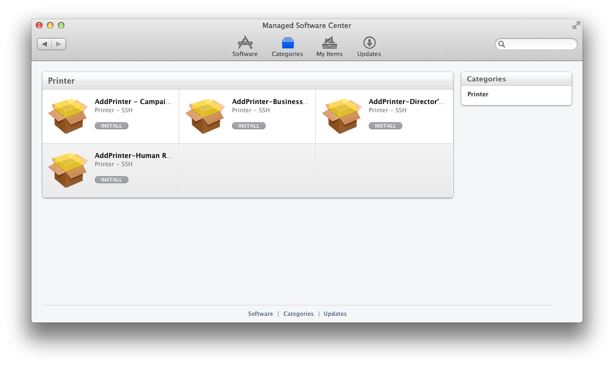

---
```bash
#!/bin/sh
printername="business_manager".sacredsf.org
location="Business Manager"
gui_display_name=$location" 4650"
address=$printername
driver_ppd="/Library/Printers/PPDs/Contents/Resources/hp color LaserJet 4650.gz"
option_1="HPOption_Duplexer=False"
currentVersion="3.0"

if [ -e /private/etc/cups/deployment/receipts/$printername.plist ]; then
	storedVersion=`/usr/libexec/PlistBuddy -c "Print :version" /private/etc/cups/deployment/receipts/$printername.plist`
	echo "Stored version: $storedVersion"
else
	storedVersion="0"
fi

versionComparison=`echo "$storedVersion < $currentVersion" | bc -l`

/usr/bin/lpstat -p $printername
if [ $? -eq 0 ]; then
	if [ $versionComparison == 0 ]; then
		exit 1
	fi
    /usr/sbin/lpadmin -x $printername
fi

/usr/sbin/lpadmin -p "$printername" -L "$location" -D "$gui_display_name" \
        -v lpd://"${address}" -P "$driver_ppd" -o "$option_1" -o printer-is-shared=false \
        -o printer-error-policy=abort-job -E

/usr/sbin/cupsenable $(lpstat -p | grep -w "printer" | awk '{print$2}')

mkdir -p /private/etc/cups/deployment/receipts
/usr/libexec/PlistBuddy -c "Add :version string" /private/etc/cups/deployment/receipts/$printername.plist
/usr/libexec/PlistBuddy -c "Set :version $currentVersion" /private/etc/cups/deployment/receipts/$printername.plist

chown -R root:_lp /private/etc/cups/deployment
chmod -R 700 /private/etc/cups/deployment

exit 0
```
[Managing Printers with Munki](https://code.google.com/p/munki/wiki/ManagingPrintersWithMunki#Alternate_Method_Using_nopkg)

---
*Give users the ability to do stuff on their own*

* Offer multiple browers, with warnings/notices about compatibility with internal sites

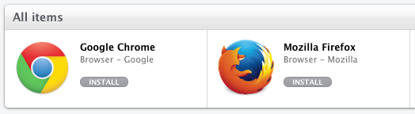
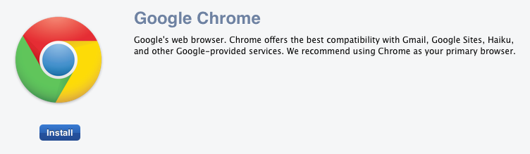

---
**Don't mandate unnecessary controls on trivial things.**
Don't force users to:

* Use a specific background.
* Use a specific account picture.
* Use your own personal Finder preferences.
* Use a pre-made Dock that can't be changed.
* Manually back up data.
* Wear stripes with plaid.


---
###Giving users more control isn't the only way to improve the experience.

###We also need to remove unnecessary obstacles, and avoid asking the user to make decisions.

---

* Manage Apple software updates:
```softwareupdate --schedule off```
* Manage third-party software updates. If possible, do them in the background, silently, and unobtrusively. 
* If you can't do them silently in the background in a reasonable way, schedule updates for a consistent time slot and communicate this to users.
* Make heavy use of profiles to manage settings for the OS, applications, and settings.

---
Remove first run dialogues from Apple apps:

* [Keynote](https://github.com/nmcspadden/Profiles/blob/master/Keynote.mobileconfig):
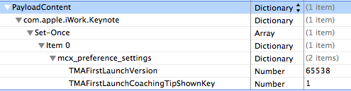
* [Pages](https://github.com/nmcspadden/Profiles/blob/master/Pages.mobileconfig) and [Numbers](https://github.com/nmcspadden/Profiles/blob/master/Numbers.mobileconfig):
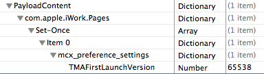 

---
Remove first run dialogues from Apple apps:

* [iMovie](https://github.com/nmcspadden/Profiles/blob/master/iMovie.mobileconfig):
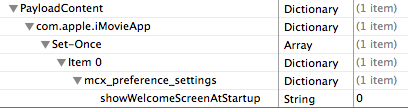
* [iPhoto](https://github.com/nmcspadden/Profiles/blob/master/iPhoto.mobileconfig):
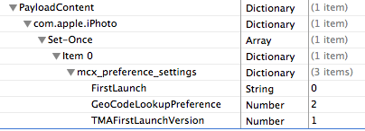

---
Remove first run dialogues from Apple apps:

* [GarageBand](https://github.com/nmcspadden/Profiles/blob/master/GarageBand.mobileconfig):
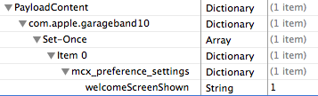

Remove the new account [setup assistant](https://github.com/nmcspadden/Profiles/blob/master/SetupAssistant.mobileconfig):
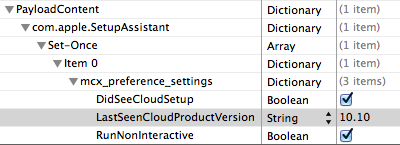

---

* Remove [menu extras](https://github.com/nmcspadden/Profiles/blob/master/MenuExtra.mobileconfig) you don't expect to use:
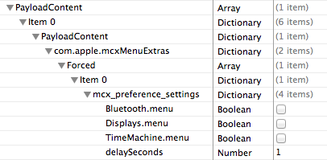

---
` `
###Depending on their job, users tend to spend a great deal of time in a web browser window.
   

   
###Removing barriers to opening up a web browser and getting access to content will go a long way towards improving the user experience.


---
Common browser improvements:

* Remove all first run dialogs (Firefox & Chrome, I'm looking at you)
* Turn off automatic updates, manage them yourself
* Test updates / versions for compatibility with critical intranet sites
* Don't manage bookmarks. Instead, provide a single site users can go to find content they need.
* If you want users to gravitate towards a specific browser, consider making it the default.

---
###Firefox:

Use Mike Kaply's [Client Customization Kit 2](https://addons.mozilla.org/en-US/firefox/addon/cck2wizard/?src=hp-dl-upandcoming) to remove all the annoying Firefoxisms.

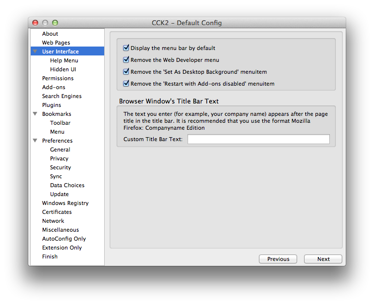

---
###Safari:

Simple to manage with a [profile](https://github.com/nmcspadden/Profiles/blob/master/Safari.mobileconfig).
Avoid over-managing, as users rely on this to sync with iOS devices.

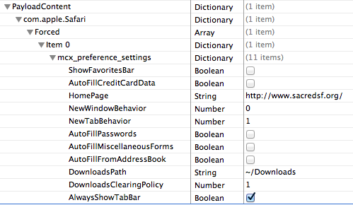

---
###Chrome:

There's a [theme](https://github.com/nmcspadden/Profiles/blob/master/Chrome.mobileconfig) here:

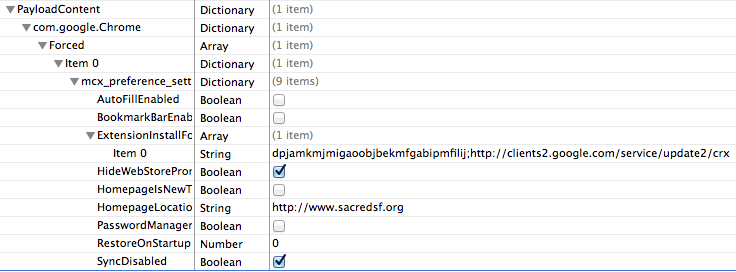

Sadly, there's more work involved in [removing the first run dialog](https://github.com/nmcspadden/Google-Chrome-Configurations).

---
###To summarize: 

### We admins have a lot of power over the user experience.

### Use it wisely! 